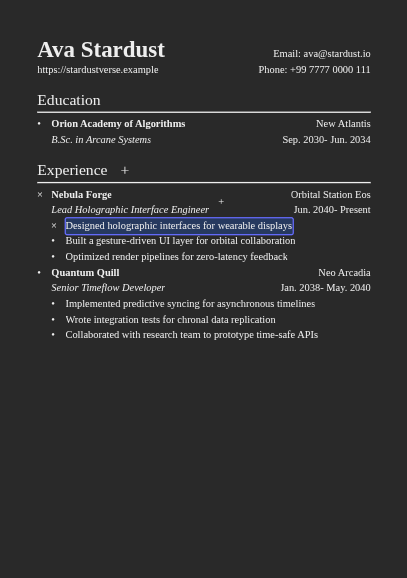

# Odin-Resume

Simple website to edit your resume 📝

With this interactive editor, you can: 
- Make live editions for contact, education and experience information
- Add / remove your experience items for each section
- Add / remove experience details

## Preview

[Visit the preview!](https://zesty-fenglisu-6aecb0.netlify.app/)

## Tech stack
- React + ReactDOM
- Vite (dev server & bundler)
- ESLint (linting)
- modern-normalize (base styles)
- uuid (generate IDs)

## Other

Resume design inspired by [sb2nov's resume template](https://github.com/sb2nov/resume)
